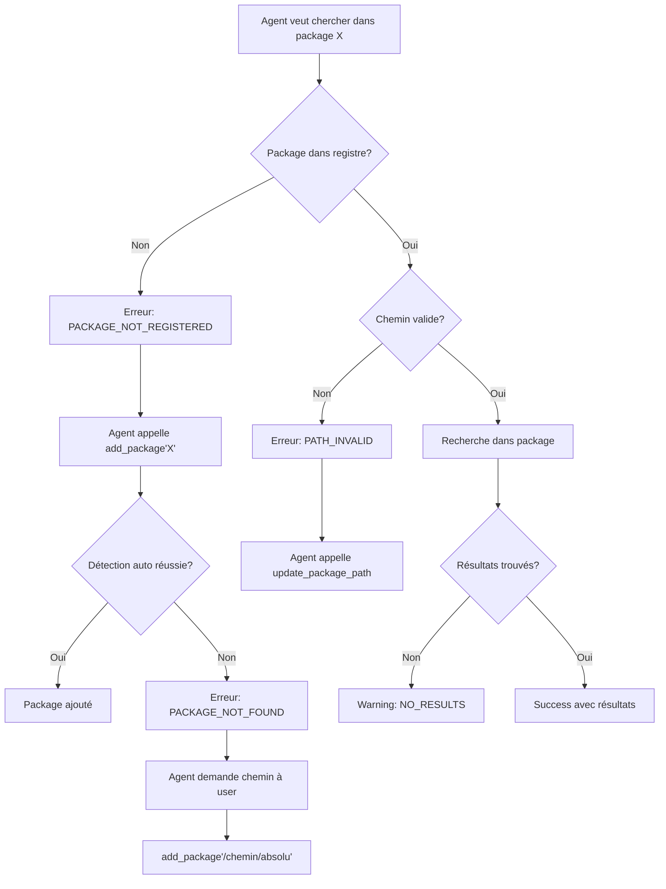

# 📊 Analyse Complète du Serveur MCP latex-search-server

## ✅ OPTIMISATIONS DE VERBOSITÉ (2025-10-08)

### 🎯 Modifications Apportées

**1. Réduction drastique du contexte dans `search_in_file()`** :
- **AVANT** : 5 lignes de contexte (2 avant + ligne + 2 après) avec préfixes
- **APRÈS** : Uniquement la ligne de définition (contexte supprimé)
- **Gain** : ~75% de réduction du volume de texte par résultat

**2. Réduction de la limite par défaut dans `search_fuzzy_command()`** :
- **AVANT** : `max_results = 20` par défaut
- **APRÈS** : `max_results = 5` par défaut
- **Gain** : 75% de réduction du nombre de résultats affichés

**3. Réduction de la longueur de définition** :
- **AVANT** : `[:200]` caractères
- **APRÈS** : `[:150]` caractères
- **Gain** : 25% de réduction de la longueur des définitions

**4. Ajout de guidance intelligente** :
- Message d'avertissement si `total_matches > max_results`
- Recommandation d'utiliser `search_in_specific_package()` pour recherches ciblées
- Documentation enrichie dans les docstrings

### 📊 Impact Estimé

**Exemple : Recherche floue de "tcb"**
- **Avant** : ~20 résultats × 5 lignes contexte × 100 chars = ~10 000 caractères
- **Après** : ~5 résultats × 1 ligne × 150 chars = ~750 caractères
- **Réduction** : **92.5%** du volume de texte

### 🎓 Recommandations d'Usage

**Pour recherche générale (découverte)** :
```python
search_fuzzy_command("tcb")  # 5 meilleurs résultats
```

**Pour recherche précise** :
```python
search_in_specific_package("tcolorbox", "tcbset", limit=10)
```

**Pour définition exacte** :
```python
search_exact_command("\\newtcolorbox")
```

---

## 🔍 Analyse du Fonctionnement Actuel

### 1. **Patterns de Recherche Actuels**

Le serveur utilise actuellement **15 patterns regex** pour détecter les définitions LaTeX :

#### Commandes Standard
- `\newcommand{\cmd}` et `\renewcommand{\cmd}`
- `\def\cmd`, `\gdef\cmd`, `\edef\cmd`, `\xdef\cmd`

#### Environnements
- `\newenvironment{env}` et `\renewenvironment{env}`

#### Packages Spécifiques
- **tcolorbox** : `\newtcolorbox{box}`, `\DeclareTColorBox{box}`
- **Théorèmes** : `\newtheorem{thm}`
- **Compteurs** : `\newcounter{cnt}`

#### LaTeX3 (syntaxe moderne)
- `\NewDocumentCommand{\cmd}` et variantes
- `\DeclareDocumentCommand{\cmd}` et variantes
- `\ProvideDocumentCommand{\cmd}` et variantes
- `\NewDocumentEnvironment{env}`

#### Couleurs
- `\definecolor{color}`

### 2. **Limitations Identifiées**

#### 🚫 **Patterns Manquants Critiques**

##### Booléens et Conditionnels
```latex
# NON DÉTECTÉS actuellement :
\newif\ifmybool
\newbool{mybool}
\providebool{mybool}
\newtoggle{mytoggle}
\providetoggle{mytoggle}
\settoggle{mytoggle}{true/false}
```

##### Longueurs et Dimensions
```latex
# NON DÉTECTÉS :
\newlength{\mylength}
\newdimen\mydimen
\setlength{\mylength}{value}
```

##### Macros Avancées
```latex
# NON DÉTECTÉS :
\let\newcmd=\oldcmd
\expandafter\def\expandafter\cmd
\csdef{commandname}
\cslet{new}{old}
```

##### Packages Spécifiques Non Couverts
```latex
# tcolorbox (CRITIQUE) :
\tcbset{mystyle/.style={...}}        # TRÈS IMPORTANT
\newtcbtheorem{mytheo}{Théorème}
\tcbuselibrary{skins, theorems}

# PGF/TikZ :
\tikzset{style/.style={...}}
\pgfkeys{/tikz/.cd, ...}
\tikzstyle{name}=[...]

# xparse (LaTeX3) :
\NewExpandableDocumentCommand
\RenewExpandableDocumentCommand

# etoolbox :
\newrobustcmd{\cmd}
\renewrobustcmd{\cmd}
\providerobustcmd{\cmd}

# ProfLycee/ProfCollege :
\NewTruc, \NewMachin (patterns spécifiques)
Commandes spécifiques non détectées

# Autres packages pédagogiques :
Patterns spécifiques non détectés
```

### 3. **Architecture Actuelle des Chemins**

#### Configuration Statique
- Les chemins sont définis dans `mcp.json`
- Seulement 2 répertoires configurés (BFcours)
- Pas de détection automatique de l'installation LaTeX

#### Problèmes Identifiés
1. **Pas de lien avec l'installation LaTeX système**
2. **Pas de détection de texmf-local, texmf-dist**
3. **Pas de gestion multi-distribution** (MiKTeX, TeX Live, MacTeX)
4. **Pas de cache des résultats**

## 🎯 Améliorations Proposées

### 1. **Enrichissement des Patterns de Recherche**

```python
# Ajouter ces patterns à DEFINITION_PATTERNS :

BOOLEAN_PATTERNS = [
    r'\\newif\\(if[a-zA-Z]+)',           # \newif\ifmybool
    r'\\newbool\{([^}]+)\}',             # \newbool{mybool}
    r'\\providebool\{([^}]+)\}',         # \providebool{mybool}
    r'\\newtoggle\{([^}]+)\}',           # \newtoggle{mytoggle}
    r'\\providetoggle\{([^}]+)\}',       # \providetoggle{mytoggle}
]

LENGTH_PATTERNS = [
    r'\\newlength\{?\\([^}]+)\}?',       # \newlength{\mylength}
    r'\\newdimen\\([a-zA-Z]+)',          # \newdimen\mydimen
    r'\\newskip\\([a-zA-Z]+)',           # \newskip\myskip
    r'\\newcount\\([a-zA-Z]+)',          # \newcount\mycount
]

ADVANCED_PATTERNS = [
    r'\\let\\([a-zA-Z]+)=',              # \let\new=\old
    r'\\cs(?:def|let|new)\{([^}]+)\}',   # etoolbox commands
    r'\\(?:new|renew|provide)robustcmd\{?\\([^}]+)\}?',  # etoolbox robust
]

TIKZ_PATTERNS = [
    r'\\tikzset\{([^/]+)/\.style',       # \tikzset{mystyle/.style=
    r'\\tikzstyle\{([^}]+)\}',           # \tikzstyle{mystyle}
    r'\\pgfkeys\{/([^/]+)',              # \pgfkeys{/mykey
]

TCOLORBOX_PATTERNS = [
    r'\\tcbset\{([^/]+)/\.style',        # \tcbset{mystyle/.style=  TRÈS IMPORTANT!
    r'\\newtcbtheorem\{([^}]+)\}',       # \newtcbtheorem{theorem}
    r'\\DeclareTCBListing\{([^}]+)\}',   # \DeclareTCBListing{mylist}
    r'\\tcbuselibrary\{([^}]+)\}',       # \tcbuselibrary{skins}
]
```

### 2. **Architecture CRUD pour la Gestion des Packages**

```python
class PackageRegistry:
    """Registre des packages avec système CRUD."""
    
    def __init__(self, config_file="packages_registry.json"):
        self.config_file = Path(config_file)
        self.packages = self.load_registry()
        self.detector = LaTeXInstallationDetector()  # Utilisé UNIQUEMENT lors de l'ajout
    
    def load_registry(self) -> dict:
        """Charge le registre des packages depuis le fichier."""
        if self.config_file.exists():
            with open(self.config_file, 'r') as f:
                return json.load(f)
        return {
            "packages": {},
            "last_updated": None
        }
    
    def save_registry(self):
        """Sauvegarde le registre dans le fichier."""
        self.packages["last_updated"] = datetime.now().isoformat()
        with open(self.config_file, 'w') as f:
            json.dump(self.packages, f, indent=2)
    
    def add_package(self, package_identifier: str) -> dict:
        """
        Ajoute un package au registre.
        
        Args:
            package_identifier: Nom du package OU chemin absolu
            
        Returns:
            Dict avec status et message
        """
        # Cas 1: Chemin absolu fourni
        if os.path.isabs(package_identifier):
            if not os.path.exists(package_identifier):
                return {
                    "status": "error",
                    "error_type": "PATH_NOT_FOUND",
                    "message": f"Le chemin {package_identifier} n'existe pas",
                    "suggestion": "Vérifiez le chemin ou utilisez le nom du package"
                }
            
            package_name = Path(package_identifier).stem
            self.packages["packages"][package_name] = {
                "path": package_identifier,
                "added_date": datetime.now().isoformat(),
                "detection_method": "manual_path",
                "verified": True
            }
            self.save_registry()
            return {
                "status": "success",
                "message": f"Package {package_name} ajouté avec chemin manuel"
            }
        
        # Cas 2: Nom de package - tenter la détection
        package_name = package_identifier
        detected_path = self.detector.find_package_location(package_name)
        
        if detected_path:
            self.packages["packages"][package_name] = {
                "path": str(detected_path),
                "added_date": datetime.now().isoformat(),
                "detection_method": "auto_detected",
                "verified": True
            }
            self.save_registry()
            return {
                "status": "success",
                "message": f"Package {package_name} détecté et ajouté",
                "path": str(detected_path)
            }
        else:
            return {
                "status": "error",
                "error_type": "PACKAGE_NOT_FOUND",
                "message": f"Package {package_name} introuvable dans l'installation LaTeX",
                "suggestion": "Fournissez le chemin absolu avec add_package('/chemin/vers/package')"
            }
    
    def remove_package(self, package_name: str) -> dict:
        """Supprime un package du registre."""
        if package_name in self.packages["packages"]:
            del self.packages["packages"][package_name]
            self.save_registry()
            return {
                "status": "success",
                "message": f"Package {package_name} supprimé du registre"
            }
        return {
            "status": "error",
            "error_type": "PACKAGE_NOT_IN_REGISTRY",
            "message": f"Package {package_name} n'est pas dans le registre"
        }
    
    def update_package_path(self, package_name: str, new_path: str) -> dict:
        """Met à jour le chemin d'un package."""
        if package_name not in self.packages["packages"]:
            return {
                "status": "error",
                "error_type": "PACKAGE_NOT_IN_REGISTRY",
                "message": f"Package {package_name} n'est pas dans le registre",
                "suggestion": f"Utilisez add_package('{package_name}') d'abord"
            }
        
        if not os.path.exists(new_path):
            return {
                "status": "error",
                "error_type": "PATH_NOT_FOUND",
                "message": f"Le nouveau chemin {new_path} n'existe pas"
            }
        
        self.packages["packages"][package_name]["path"] = new_path
        self.packages["packages"][package_name]["updated_date"] = datetime.now().isoformat()
        self.packages["packages"][package_name]["verified"] = True
        self.save_registry()
        
        return {
            "status": "success",
            "message": f"Chemin du package {package_name} mis à jour"
        }
    
    def get_package_path(self, package_name: str) -> Optional[str]:
        """Récupère le chemin d'un package avec vérification."""
        if package_name not in self.packages["packages"]:
            return None
        
        package_info = self.packages["packages"][package_name]
        path = package_info["path"]
        
        # Vérifier que le chemin existe toujours
        if not os.path.exists(path):
            package_info["verified"] = False
            self.save_registry()
            return None
        
        return path
    
    def list_packages(self) -> dict:
        """Liste tous les packages enregistrés avec leur statut."""
        result = {"packages": []}
        
        for name, info in self.packages["packages"].items():
            exists = os.path.exists(info["path"])
            result["packages"].append({
                "name": name,
                "path": info["path"],
                "exists": exists,
                "detection_method": info.get("detection_method", "unknown"),
                "added_date": info.get("added_date"),
                "verified": exists
            })
        
        return result


class LaTeXInstallationDetector:
    """Détection UNIQUEMENT lors de l'ajout d'un package."""
    
    def find_package_location(self, package_name: str) -> Optional[Path]:
        """
        Trouve l'emplacement d'un package - appelé UNIQUEMENT lors de add_package().
        """
        # Essayer kpsewhich (TeX Live, MacTeX)
        try:
            result = subprocess.run(
                ['kpsewhich', f'{package_name}.sty'],
                capture_output=True, text=True, timeout=5
            )
            if result.returncode == 0 and result.stdout.strip():
                return Path(result.stdout.strip()).parent
        except (FileNotFoundError, subprocess.TimeoutExpired):
            pass
        
        # Essayer MiKTeX sur Windows
        if sys.platform == "win32":
            miktex_paths = [
                Path(r"C:\Program Files\MiKTeX\tex\latex"),
                Path(r"C:\Users") / os.environ.get("USERNAME", "") / r"AppData\Roaming\MiKTeX\tex\latex"
            ]
            for base_path in miktex_paths:
                if base_path.exists():
                    package_path = base_path / package_name
                    if package_path.exists():
                        return package_path
        
        return None
```

### 3. **Nouvelles Fonctions MCP avec Gestion d'Erreurs Détaillée**

```python
@mcp.tool()
def add_package(package_identifier: str) -> str:
    """
    Ajoute un package au registre pour les recherches futures.
    
    Args:
        package_identifier: Nom du package (ex: "tikz") OU chemin absolu
    
    Returns:
        JSON avec status détaillé
    """
    registry = PackageRegistry()
    result = registry.add_package(package_identifier)
    
    return json.dumps(result, ensure_ascii=False, indent=2)


@mcp.tool()
def remove_package(package_name: str) -> str:
    """
    Supprime un package du registre.
    
    Args:
        package_name: Nom du package à supprimer
    
    Returns:
        JSON avec status
    """
    registry = PackageRegistry()
    result = registry.remove_package(package_name)
    
    return json.dumps(result, ensure_ascii=False, indent=2)


@mcp.tool()
def update_package_path(package_name: str, new_path: str) -> str:
    """
    Met à jour le chemin d'un package existant.
    
    Args:
        package_name: Nom du package
        new_path: Nouveau chemin absolu
    
    Returns:
        JSON avec status
    """
    registry = PackageRegistry()
    result = registry.update_package_path(package_name, new_path)
    
    return json.dumps(result, ensure_ascii=False, indent=2)


@mcp.tool()
def list_registered_packages() -> str:
    """
    Liste tous les packages enregistrés avec leur statut.
    
    Returns:
        JSON avec la liste des packages et leur état
    """
    registry = PackageRegistry()
    result = registry.list_packages()
    
    return json.dumps(result, ensure_ascii=False, indent=2)


@mcp.tool()
def search_in_specific_package(
    package_name: str, 
    command_pattern: str = "", 
    search_type: str = "all",
    offset: int = 0,
    limit: int = 20
) -> str:
    """
    Recherche dans un package LaTeX spécifique ENREGISTRÉ avec pagination.
    
    Args:
        package_name: Nom du package (doit être dans le registre)
        command_pattern: Pattern de recherche (vide = lister avec limite)
        search_type: Type ("commands", "environments", "booleans", "styles", "all")
        offset: Index de départ pour la pagination (défaut: 0)
        limit: Nombre max de résultats à retourner (défaut: 20, max: 50)
    
    Returns:
        JSON avec résultats paginés OU message d'erreur détaillé
    """
    registry = PackageRegistry()
    
    # 1. Vérifier que le package est enregistré
    package_path = registry.get_package_path(package_name)
    
    if package_path is None:
        # Chercher si le package existe mais n'est pas enregistré
        if package_name not in registry.packages["packages"]:
            return json.dumps({
                "status": "error",
                "error_type": "PACKAGE_NOT_REGISTERED",
                "message": f"Le package '{package_name}' n'est pas dans le registre",
                "registered_packages": list(registry.packages["packages"].keys()),
                "suggestion": f"Utilisez d'abord: add_package('{package_name}')"
            }, ensure_ascii=False, indent=2)
        else:
            # Le package est enregistré mais le chemin n'existe plus
            return json.dumps({
                "status": "error",
                "error_type": "PATH_INVALID",
                "message": f"Le chemin du package '{package_name}' n'est plus valide",
                "old_path": registry.packages["packages"][package_name]["path"],
                "suggestion": f"Utilisez: update_package_path('{package_name}', '/nouveau/chemin')"
            }, ensure_ascii=False, indent=2)
    
    # 2. Sélectionner les patterns selon le type
    patterns = []
    if search_type in ["commands", "all"]:
        patterns.extend(COMMAND_PATTERNS)
    if search_type in ["environments", "all"]:
        patterns.extend(ENVIRONMENT_PATTERNS)
    if search_type in ["booleans", "all"]:
        patterns.extend(BOOLEAN_PATTERNS)
    if search_type in ["styles", "all"]:
        patterns.extend(TCOLORBOX_PATTERNS + TIKZ_PATTERNS)
    
    # 3. Limiter le limit à 50 max pour éviter trop de tokens
    limit = min(limit, 50)
    
    # 4. Scanner le package
    try:
        all_results = scan_directory(package_path, command_pattern, patterns)
        
        if not all_results:
            return json.dumps({
                "status": "warning",
                "warning_type": "NO_RESULTS",
                "message": f"Aucune commande '{command_pattern}' trouvée dans '{package_name}'",
                "package": package_name,
                "path": package_path,
                "search_type": search_type,
                "suggestion": "Essayez un pattern plus général ou vérifiez l'orthographe"
            }, ensure_ascii=False, indent=2)
        
        # 5. Appliquer la pagination
        total_results = len(all_results)
        paginated_results = all_results[offset:offset + limit]
        has_more = (offset + limit) < total_results
        
        return json.dumps({
            "status": "success",
            "package": package_name,
            "path": package_path,
            "search_type": search_type,
            "pattern": command_pattern,
            "pagination": {
                "offset": offset,
                "limit": limit,
                "total": total_results,
                "returned": len(paginated_results),
                "has_more": has_more,
                "next_offset": offset + limit if has_more else None
            },
            "results": paginated_results
        }, ensure_ascii=False, indent=2)
        
    except Exception as e:
        return json.dumps({
            "status": "error",
            "error_type": "SCAN_ERROR",
            "message": f"Erreur lors du scan du package '{package_name}'",
            "error_details": str(e),
            "path": package_path,
            "suggestion": "Vérifiez les permissions ou réessayez"
        }, ensure_ascii=False, indent=2)
```

### 4. **Détection Intelligente du Type de Définition**

```python
def classify_definition(line: str, match: re.Match) -> dict:
    """Classifie le type de définition trouvée."""
    
    classification = {
        "type": "unknown",
        "category": "misc",
        "complexity": "simple",
        "arguments": 0,
        "optional_args": False
    }
    
    # Déterminer le type
    if r'\newif' in line or r'\newbool' in line:
        classification["type"] = "boolean"
        classification["category"] = "conditional"
    elif r'\newlength' in line or r'\newdimen' in line:
        classification["type"] = "length"
        classification["category"] = "dimension"
    elif r'\newcommand' in line:
        classification["type"] = "command"
        # Analyser les arguments
        if '[' in line:
            classification["optional_args"] = True
        # Compter les arguments obligatoires
        args_match = re.search(r'\[(\d+)\]', line)
        if args_match:
            classification["arguments"] = int(args_match.group(1))
    elif r'\newenvironment' in line:
        classification["type"] = "environment"
        classification["category"] = "structural"
    
    # Évaluer la complexité
    if len(line) > 200:
        classification["complexity"] = "complex"
    elif len(line) > 100:
        classification["complexity"] = "medium"
    
    return classification
```


## 🎯 Système de Messages d'Erreur Détaillés

### Types d'Erreurs et Réponses

```python
ERROR_TYPES = {
    "PACKAGE_NOT_REGISTERED": {
        "description": "Package non enregistré dans le système",
        "fields": ["message", "registered_packages", "suggestion"],
        "action": "L'agent doit appeler add_package() avant de rechercher"
    },
    
    "PATH_INVALID": {
        "description": "Le chemin enregistré n'existe plus",
        "fields": ["message", "old_path", "suggestion"],
        "action": "L'agent doit appeler update_package_path() avec un nouveau chemin"
    },
    
    "PATH_NOT_FOUND": {
        "description": "Chemin fourni inexistant",
        "fields": ["message", "suggestion"],
        "action": "Vérifier le chemin ou utiliser le nom du package pour auto-détection"
    },
    
    "PACKAGE_NOT_FOUND": {
        "description": "Package introuvable dans l'installation LaTeX",
        "fields": ["message", "suggestion"],
        "action": "Fournir le chemin absolu ou vérifier l'installation"
    },
    
    "NO_RESULTS": {
        "description": "Recherche sans résultat",
        "fields": ["message", "package", "path", "search_type", "suggestion"],
        "action": "Élargir le pattern ou vérifier l'orthographe"
    },
    
    "SCAN_ERROR": {
        "description": "Erreur lors du scan",
        "fields": ["message", "error_details", "path", "suggestion"],
        "action": "Vérifier les permissions ou réessayer"
    }
}
```

### Workflow pour les Agents



## 📋 Recommandations d'Implémentation

### Phase 1 : Enrichissement des Patterns (Priorité HAUTE)
1. ✅ Ajouter patterns pour booléens, longueurs, macros avancées
2. ✅ Ajouter patterns tcolorbox (`\tcbset` TRÈS IMPORTANT)
3. ✅ Ajouter patterns TikZ et autres packages

### Phase 2 : Système CRUD (Priorité HAUTE)
1. ✅ Implémenter `PackageRegistry` avec méthodes CRUD
2. ✅ Créer `add_package()` avec détection optionnelle
3. ✅ Gestion des erreurs détaillée pour guider les agents
4. ✅ Persistance dans `packages_registry.json`

### Phase 3 : API MCP Enrichie (Priorité HAUTE)
1. ✅ `add_package(identifier)` - Ajout avec détection intelligente
2. ✅ `remove_package(name)` - Suppression du registre
3. ✅ `update_package_path(name, path)` - Mise à jour chemin
4. ✅ `list_registered_packages()` - Liste avec statut
5. ✅ `search_in_specific_package()` - Recherche ciblée avec erreurs


## 🎯 Impact pour les Agents

Avec le nouveau système CRUD, les agents pourront :

### Workflow Type pour un Agent

```python
# 1. L'agent veut utiliser ProfCollege
response = search_in_specific_package("profcollege", "")

# 2. Si erreur PACKAGE_NOT_REGISTERED
if response["error_type"] == "PACKAGE_NOT_REGISTERED":
    # Tenter l'ajout automatique
    add_result = add_package("profcollege")
    
    if add_result["status"] == "error":
        # Demander le chemin à l'utilisateur
        user_path = ask_user("Où est installé ProfCollege?")
        add_package(user_path)  # Chemin absolu
    
    # Maintenant on peut rechercher
    response = search_in_specific_package("profcollege", "")

# 3. Si PATH_INVALID (chemin obsolète)
elif response["error_type"] == "PATH_INVALID":
    # Mettre à jour le chemin
    new_path = detect_or_ask_path("profcollege")
    update_package_path("profcollege", new_path)
    
    # Réessayer la recherche
    response = search_in_specific_package("profcollege", "")

# 4. Utiliser les résultats
if response["status"] == "success":
    commands = response["results"]
    # Utiliser les commandes trouvées...
```

### Avantages du Système CRUD

1. **Performance** : Pas de détection à chaque requête
2. **Flexibilité** : Support nom de package ET chemin absolu
3. **Guidage** : Messages d'erreur clairs avec actions suggérées
4. **Persistance** : Packages enregistrés entre sessions
5. **Autonomie** : Agents peuvent gérer leurs packages
6. **Spécificité** : Recherche dans `\tcbset` pour tcolorbox !

### Exemples de Commandes

```python
# Ajouter un package (détection auto)
add_package("tikz")

# Ajouter avec chemin manuel
add_package("C:/texlive/2024/texmf-dist/tex/latex/profcollege")

# Lister les packages disponibles
list_registered_packages()

# Rechercher les styles tcolorbox
search_in_specific_package("tcolorbox", "tcbset", "styles")

# Rechercher les booléens dans etoolbox (avec pagination)
search_in_specific_package("etoolbox", "", "booleans", offset=0, limit=20)

# Obtenir les 20 résultats suivants
search_in_specific_package("etoolbox", "", "booleans", offset=20, limit=20)
```

## 💡 Conclusion

La nouvelle architecture proposée résout les problèmes principaux :

### ✅ **Problèmes Résolus**
1. **Patterns manquants** → Ajout de 30+ nouveaux patterns (tcbset, booléens, etc.)
2. **Détection lourde** → Système CRUD avec détection uniquement à l'ajout
3. **Pas de ciblage** → `search_in_specific_package()` pour recherche précise
4. **Erreurs vagues** → Messages détaillés avec actions suggérées
5. **Configuration rigide** → Support nom de package ET chemin absolu

### 🚀 **Bénéfices Clés**
- **Performance** : Détection une seule fois, pas à chaque requête
- **Flexibilité** : Les agents peuvent ajouter/gérer leurs packages
- **Guidage** : Erreurs explicites qui disent quoi faire
- **Autonomie** : Les agents s'adaptent aux erreurs
- **Précision** : Recherche de `\tcbset` et autres patterns critiques

### 📝 **Workflow Simple**
1. Agent essaie de chercher → Erreur si pas enregistré
2. Agent ajoute le package → Détection automatique ou manuelle
3. Agent recherche → Succès avec résultats détaillés

Cette architecture est **légère**, **efficace** et **intuitive** pour les agents !